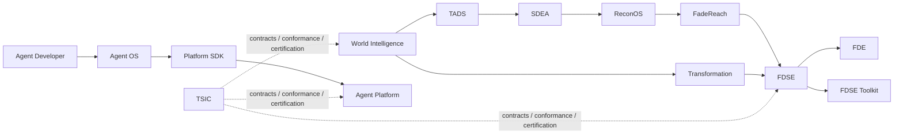

<div align="center">

# Tinlance System Integration & Conformance (TSIC)

**The canonical integration control plane for defining, validating, and certifying interoperability across the Tinlance system-of-systems.**

[](https://github.com/LloydCoder/tinlance-system-integration/actions/workflows/ci.yml)
[](LICENSE)
[](https://scorecard.dev/viewer/?uri=github.com/LloydCoder/tinlance-system-integration)

</div>

> [!NOTE]
> TSIC is a **control-plane and conformance repository**. It does not replace domain runtimes, authorization engines, agent execution, or application logic.

## Visual proof



The repository also contains executable verification gates for conformance, canonical workflows, recovery scenarios, ecosystem-lock policy, security-pattern scanning, and forensic consistency checks.

## Why TSIC

| Concern | TSIC provides | TSIC does not provide |
|---|---|---|
| Authority | Canonical ownership and conflict detection | Domain runtime ownership |
| Contracts | Versioned machine-readable integration contracts | Application business logic |
| Interoperability | Adapter rules and MCP/A2A gates | A replacement for Agent Platform |
| Verification | Deterministic CI and executable reference workflows | Proof that every external production deployment is reachable |
| Reliability | Failure/replay/recovery certification | Infrastructure-specific HA implementation |
| Governance | Ecosystem lock and compatibility policy | Unilateral authority over domain systems |

## Quick Start

```bash
git clone https://github.com/LloydCoder/tinlance-system-integration.git
cd tinlance-system-integration
python3 tooling/validate_phase0.py
python3 tooling/run_reference_workflow.py
python3 tooling/forensic_audit.py
```

A successful run validates the repository's current integration gates without requiring external services.

## Installation

TSIC is a repository-level integration specification and verification system; it is not distributed as a Python package.

### Prerequisites

- Git
- Python 3.10+
- A POSIX shell for the documented commands

### From source

```bash
git clone https://github.com/LloydCoder/tinlance-system-integration.git
cd tinlance-system-integration
python3 tooling/validate_phase0.py
```

No third-party Python package installation is required by the current tooling.

## Usage

### Validate the complete repository

```bash
python3 tooling/validate_phase0.py
python3 tooling/run_reference_workflow.py
python3 tooling/recovery_cert.py
python3 tooling/ecosystem_lock.py
python3 tooling/forensic_audit.py
python3 tooling/security_scan.py
```

### Normative surfaces

| Surface | Purpose |
|---|---|
| `manifests/` | Canonical ecosystem registry |
| `catalog/` | Systems, authorities, services, contracts, dependencies |
| `contracts/` | Normative integration contracts |
| `schemas/` | JSON Schema definitions |
| `integrations/` | Adapter registry and system boundaries |
| `conformance/` | Phase acceptance requirements |
| `workflows/` | Canonical executable integration paths |
| `reliability/` | Failure and recovery scenarios |
| `policies/` | Ecosystem enforcement policy |
| `docs/` | Architecture, operations, governance, security, and reference material |
| `tooling/` | Deterministic validation and certification tooling |

## Configuration and options

| Tool | Inputs | Default behavior |
|---|---|---|
| `validate_phase0.py` | Repository files | Validates JSON, registry identity, authority ownership, and phase gates |
| `run_reference_workflow.py` | `workflows/canonical.json` | Validates the three canonical workflow routes |
| `recovery_cert.py` | `reliability/failure-matrix.json` | Requires core failure scenarios and responses |
| `ecosystem_lock.py` | `policies/ecosystem-lock.json` | Enforces ecosystem lock invariants |
| `forensic_audit.py` | Repository | Cross-checks registries, workflows, adapters, placeholders, and secrets |
| `security_scan.py` | Repository | Scans supported text/config files for high-risk secret patterns |

## Features

| Capability | Status |
|---|---|
| Canonical system-of-systems model | Implemented |
| Authority reconciliation | Implemented |
| Identity and agent registration contracts | Implemented |
| Event and trace fabric | Implemented |
| Service/dependency/contract registries | Implemented |
| Model-routing and agent interoperability gates | Implemented |
| Adapter registry and integration rules | Implemented |
| Economic attribution spine | Implemented |
| Ecosystem lock | Implemented |
| Canonical E2E workflows | Implemented |
| Failure/replay/recovery certification | Implemented |
| Forensic certification | Implemented |
| Cross-repository runtime adoption | Next integration program |

## Documentation

Start with:

- [Documentation index](docs/README.md)
- [Canonical architecture](docs/architecture/canonical-system-model.md)
- [Authority model](docs/architecture/authority-model.md)
- [Identity and agent registration](docs/architecture/identity-and-agent-registration.md)
- [Event and trace fabric](docs/contracts/event-and-trace-fabric.md)
- [Adapter fabric](docs/integrations/adapter-fabric.md)
- [End-to-end integration](docs/operations/e2e-integration.md)
- [Failure and recovery certification](docs/operations/failure-recovery-certification.md)
- [Production system-of-systems certification](docs/certification/production-system-of-systems.md)
- [2026 standards baseline](docs/standards/2026-baseline.md)

For AI-assisted repository discovery, see [llms.txt](llms.txt).

## Contributing

Please read [CONTRIBUTING.md](CONTRIBUTING.md) before opening a pull request. Material architecture changes require an ADR; normative contract changes require compatibility analysis; CI must remain green.

## License and acknowledgements

TSIC is licensed under the [Apache License 2.0](LICENSE).

The repository follows interoperability and supply-chain practices informed by JSON Schema, OpenTelemetry, W3C Trace Context, AsyncAPI, CloudEvents, A2A, GitHub Actions, and OpenSSF Scorecard.

<details>
<summary>Roadmap</summary>

1. Maintain the certified TSIC control plane.
2. Adopt TSIC contracts in authoritative Tinlance repositories.
3. Add cross-repository contract and compatibility tests.
4. Execute real ecosystem integration workflows.
5. Re-certify after material architecture or contract changes.

</details>

<details>
<summary>Troubleshooting</summary>

If a gate fails, run the failing script directly from the repository root. The scripts are intentionally deterministic and report the invariant that failed. Fix the source artifact rather than bypassing the gate.

</details>

<details>
<summary>Support</summary>

See [SUPPORT.md](SUPPORT.md) for questions, usage guidance, and issue routing. Security vulnerabilities must follow [SECURITY.md](SECURITY.md).

</details>
